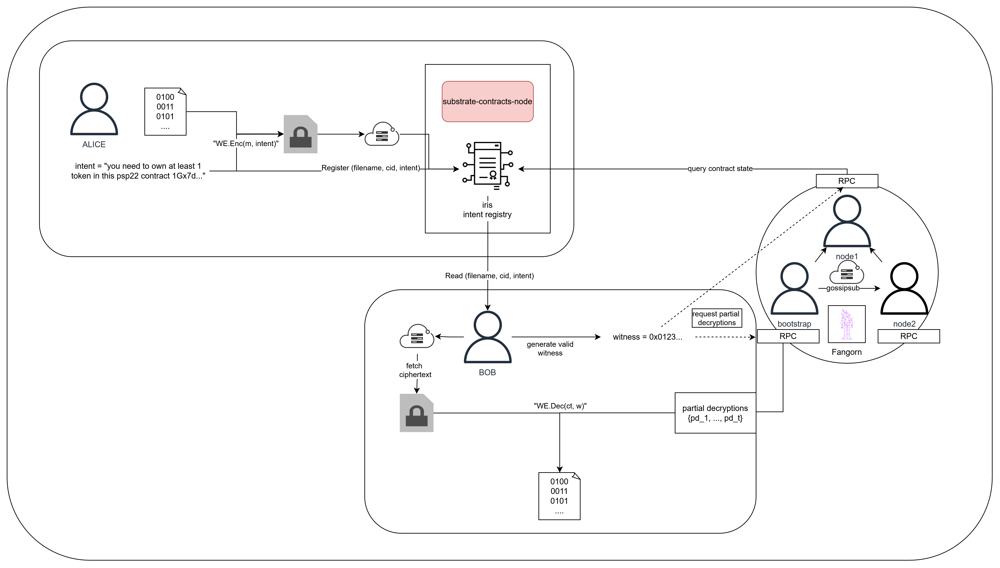

# Fangorn

> "Certainly the forest of **Fangorn** is perilous — not least to those that are too ready with their axes; and Fangorn himself, he is perilous too; yet he is wise and kindly nonetheless.”
― J.R.R. Tolkien, The Lord of the Rings

---

Fangorn is a distributed threshold encryption network enabling practical witness encryption on Polkadot.

It allows you to encrypt data under public statements (**intents**) that are stored onchain, with decryption possible if and only if that condition is provably met (with a valid **witness**). 

It uses a breakthrough in threshold encryption, [silent-threshold-encryption](https://eprint.iacr.org/2024/263), to enable a robust, fault-tolerant, and permissionless network where nodes can freely join and leave without requiring an expensive distributed key generation (DKG) ceremony.

Through an extensible **gadget** framework, our system allows for new mechanisms for *decentralized conditional access control* to be easily implemented and **composed** to form more complex statements.

It also supports a modular and dynamic storage backend, which  can be customized for specialized plaintext locations, intent storage locations, and ciphertext download locations. 

### Key Features
- decentralized conditional access control via extensible gadgets framework
- censorship/ransomware resistance
- fault tolerant, robust, and permissionless threshold encryption network
- configurable backend with multi-chain support possible

### Intent Bound Data

We describe the resulting paradigm as intent-bound data. Using Fangorn, users can encrypt messages under *intent*, such as "I own an NFT" or "I am a member of this DAO" without needing to engage with key management system or complex key exchanges or DKG ceremonies. It enables the convenience of web2 with the soverignty and ownership models of web3. Intent-bound data aims to revolutionize access control for web3. **We aim to realize the same UX as piracy, but where creators still get paid.** 

This is a tool for a **post-platform economy**:

- digital property rights: own what you buy instead of renting access. 
- creatory soverignty: truly control content distribution instead of relying on platforms
- user privacy: no databases, no tracking, no data collection
- permissionless & decentralized: can't be shut down, workers don't know what they are decrypting
- convivial tech: value flows to creators and consumers, not intermediaries

## What We Delivered

- **[fangorn](./fangorn/README.md)** - P2P threshold encryption network (Rust + Iroh)
- **[iris-contract](./iris-contract/README.md)** - Intent registry (ink!)
- **[psp22-token](./psp22-token/README.md)** - Example PSP22 token
- **[quickbeam](./quickbeam/README.md)** - CLI tool
- **[entmoot](./entmoot/README.md)** - Terminal UI
- **[iris-visualizer](./iris-visualizer/README.md)** - React web app

→ See [setup guide](./docs/setup.md) for installation. 

→ See [gadget documentation](./fangorn/src/gadget/README.md) for creating custom access control types.

---

## Quick start

> Important! The UI fails to run on firefox but will run fine on Chrome and Brave with no issues.

See the [setup guide](./docs/setup.md).

---

## How it Works

The idea behind Fangorn is that users can encrypt data for predefined gadgets that determine rules. Fangorn **workers** execute these gadgets, verifying **witness** data provided by the user via an RPC endpoint. Whenever witnesses can be verified, and at least a threshold of nodes agree, then they each produce a **partial decrypt** that can be used to decrypt some ciphertext.

Fangorn operates as a distributed p2p network. After initial setup, the nodes **never** need to communicate again unless gossiping information related to a new node joining the forest. Encryption is completely non-interactive, while decryption requires calling each nodes' RPC.

For encryption, users simply:
1. define their intent (must be supported by Fangorn)
2. Encrypt their data under Fangorn's public encryption key 
3. Store the ciphertext in some kind of shared storage
4. Store the intent in a smart contract
and that's it!

For decryption, the process is somewhat more complex, involving interaction with the Fangorn network. This interaction is done by a simple RPC call. To decrypt:
1. Read the intent from the smart contract and produce a vdalid witness
2. Request t-of-n partial decryptions from Fangorn workers
3. Aggregated them, and fetch the ciphertext from shared storage
4. Decrypt the ciphertext and download it

### Gadgets (Extensible Access Control)

 In the scope of the hackathon, we have implemented three gadgets:

- **password-gadget** - a minimalistic gadget implementation that allows data to be encrypted under a (one-time-use) password
- **psp22-gadget** - allows data to be encrypted such that knowledge of the public key of anyone owning at least a minimum balance of the token defined in the psp22 contract can decrypt the data
- **sr25519-gadget** - verify a schnorr signature

Gadgets can be **composed** to build more complex statements. To demonstrate, by composing the psp2-gadget and sr25519 gadget, we achieve **token-gated content**. 

e.g. `Psp22(contract_address, min_balance) && Sr25519()`

See [gadget docs](./fangorn/src/gadget/README.md) to create custom types.

## Use Cases

The use cases made possible with this framework are very broad, even with our semi-naive implementation.

- **Creator economy:**
  - Direct artist-to-consumer sales:
    - Encrypt album → Sell PSP22 NFT → Buyer owns forever
  - new kinds of open data marketplaces
  - Time or Location-gated content
  - zkId gated content
  - proof-of-membership gated content
  - The only limit is your imagination.

**Web3 dApps and more:**
- conditionally-executed transactions (e.g. password-gated payments)
- on-chain secret sharing
- encrypted mempools for MEV elimination (as in [this forum post](https://forum.polkadot.network/t/encrypted-mempools-turning-polkadots-mev-leak-into-treasury-revenue/15817))
- More robust, data-heavy apps become possible and practical:
  - e.g. decentralized Spotify, Youtube, etc.
  - DAOs with member-gated resources
  - Social networks without centralized APIs

**Cross-chain (XCM-ready):**
- Verify conditions across parachains
- "Holds DOT on relay + owns RMRK NFT"

---

## Documentation

- [Setup Guide](./docs/setup.md) - Installation and configuration
- [Gadget Framework](./fangorn/src/gadget/README.md) - Create custom access types
- [Architecture](./docs/architecture.md) - System design overview
- [Quickbeam CLI](./quickbeam/README.md)

---

## Built With

- **Polkadot SDK** - Substrate + ink! contracts
- **Iroh** - P2P networking
- **Silent Threshold Encryption**:
  - Built with Arkworks
  - [Research paper](https://eprint.iacr.org/2024/263)
  - [Our Fork](https://github.com/driemworks/silent-threshold-encryption/tree/dev)
---

## Future Work

This is a proof-of-concept only. While there remains significant work in increasing code quality, especially introducing robust testing the codebase, there are various other, more high level aspects that we think it would be interesting to explore:

- **Advanced implementation**: We have outlined a concept for a more advanced and extendable version of intent-bound-data that would make the network more robust. This includes both a new way of bundling intent with data (see: [here](./docs/encryption_flow.md)) as well as as more robust sync protocol. Specifically, our current implementation requires that nodes publish a unique index when joining the network, which is an optimization that we can likely obfuscate using the gossip layer. In addition, worker nodes do not have a keystore right now - they just generate random keys each time. Future work would introduce a more robust keystore for storing iroh keys as well as Fangorn ones.
- **Shared storage implementations**: We only implemented local shared storage structs for now(meaning Fangorn can only run if all nodes are on the same machine). It should be straightforward to implement shared storage against a centralized db or an IPFS swarm.
- **zk-gadgets**: currently, each gadget requires a public, plaintext witness that reveals it to the Fangorn workers. This is fine for now, but is not privacy preserving. Instead, we would investigate the implementation of zk-gadgets for verification of witnesses, resulting in a privacy-preserving way to use Fangorn.
- **Economic integration**: This version of Fangorn has no economic incentives for workers to operate, especially to operate honestly. In the future, we would investigate an economic integration layer, perhaps as a smart contract or parachain, where we can leverage staking mechanisms to both authorize and incentivize Fangorn workers. 

---

## License

Apache 2.0
