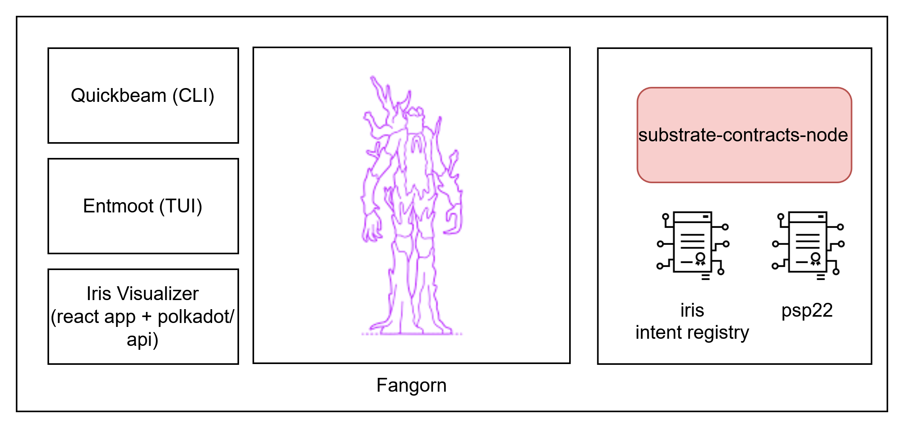
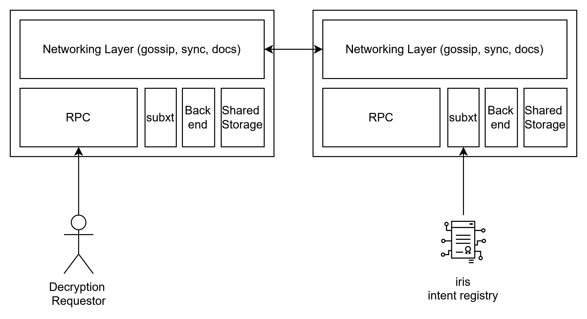

# Architecture

This project consists of several high level components. The Fangorn network operates as a permissionless service against which Quickbeam and Entmoot can request decryption. Encryption requires no interaction with the core Fangorn network.

## 100,000-meter view

Fangorn is the core of the system that enables intent-bound content. It operates against a substrate-backend, where it requries an intent-registry (iris) contract be deployed on the same chain that it is running against. The fangorn worker nodes all must be able to read the state of the contract. 

Entmoot and Quickbeam are both mechanisms for interacting with Fangorn for encryption and decryption. Quickbeam is a basic CLI and Entmoot is TUI which boasts better UX and error handling.

The iris visualizer is a basic UI component for browsing contents of the intent registry.

## Fangorn Nodes

Each Fangorn node is quite simple. It uses n0-computer's Iroh library to implement a robust gossip layer between nodes. When new nodes join the network, they receive public parameters and public keys automatically from other nodes through a simple sync protocol.

Each node supports gadgets as they are defined in their [**gadget registry**](../fangorn/src/gadget/README.md). As silent-threshold-encryption has multi-universe support, not all nodes need to support the same gadgets! We only require that nodes in the same 'universe' support the same gadgets. This makes the network capable of supporting specialized 'universes' with unique gadget implementation.

## Sync Protocol and User Interaction

Below, the diagram demonstrates how all participants in the system interact, from Fangorn workers to users.

Users (e.g. through entmoot) interact with Fangorn nodes by calling an RPC endpoint. To get a partial decryption, must get at least a threshold of shared from each node. In addition, the /preprocess endpoint outputs the network's public keys that are needed for both encryption and decryption.

