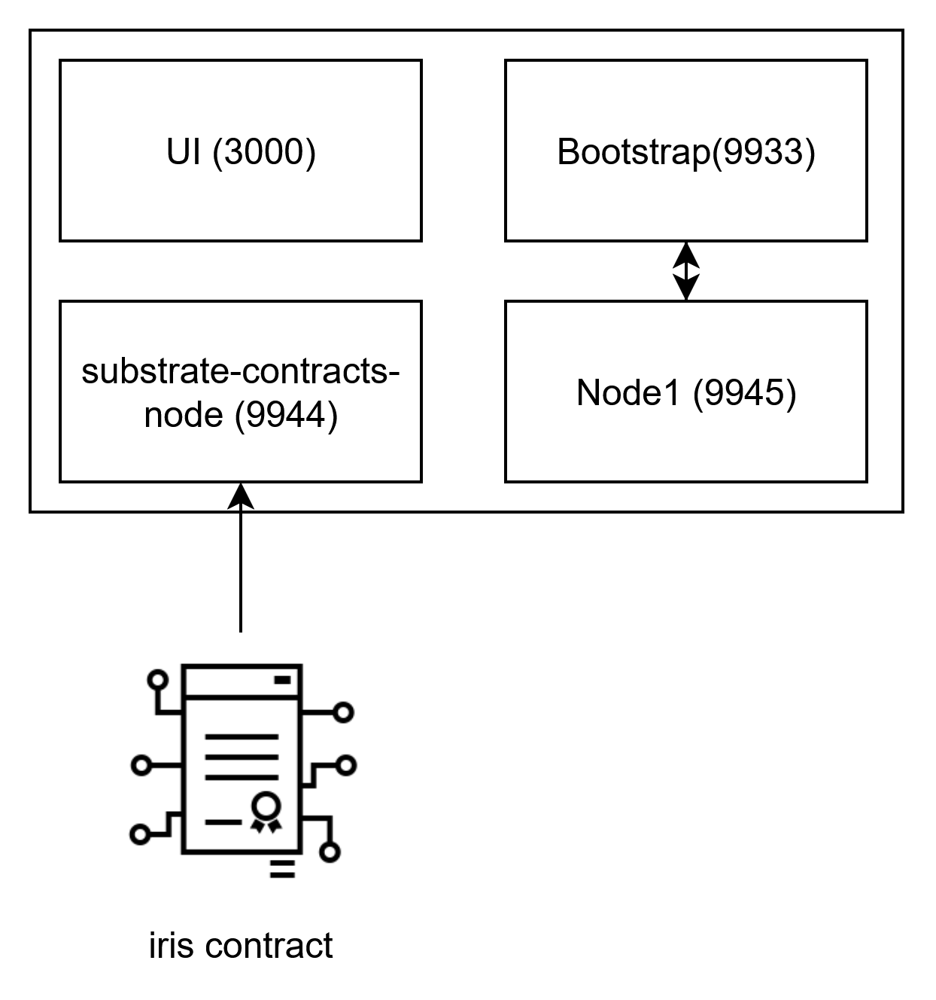

## Setup Guide

This is a guide to run a local Fangorn forest and manually encrypt/decrypt.

### Prerequisites (One Time Setup)

This library is built with subxt and requires that you generate the proper metadata.scale. If you intend to use the substrate-contract-node, the included metadata file will suffice. Otherwise, you **must** perform this one-time setup to generate the metadata.

1. [Install cargo contract](https://github.com/use-ink/cargo-contract)
2. Build the 'iris' contract locally (from the root):
   ``` sh
   cd contracts/iris
   cargo contract build --release
   ```

3. Install the substrate contracts node: `cargo install contracts-node`. It can be run locally by running `substrate-contracts-node`, starting the contracts node on port 9944 by default.
4. Then, from the project root, generate metadata with `subxt metadata --url ws://localhost:9944 > metadata.scale`
5. Tear down the contracts node, then build the binaries. From the root, run: `cargo build`.
6. For Fangorn nodes to work, they currently expect for an sr25519 entry to already exist in tmp/keystore. When running your own node, you can control the name of the entry, the password for the entry, and the password for the vault. However, if using the start instances script the nodes expect very specific configurations.
`./target/debug/quickbeam keygen-pswd --keystore-dir tmp/keystore --key-name sr25519_idx_0 --password substrate_password_0 -p polkadot`
and
`./target/debug/quickbeam keygen-pswd --keystore-dir tmp/keystore --key-name sr25519_idx_1 --password substrate_password_1 -p polkadot`.
This will set up the keys for the two listening nodes that will verify witnesses and provide partial decryptions. Be sure to create keys
for the nodes that requesting for encryption and decryption
`./target/debug/quickbeam keygen-pswd --keystore-dir tmp/keystore --key-name sr25519_idx_2 --password substrate_password_2 -p polkadot`
`./target/debug/quickbeam keygen-pswd --keystore-dir tmp/keystore --key-name sr25519_idx_3 --password substrate_password_3 -p polkadot`
Be sure to copy the mnemonic that is printed to the terminal in order to reproduce the keypairs later if needed.

### Build a Network

You must run a minimum of 2 Fangorn nodes.

- For a modular approach (e.g. to setup a node on a dedicated machine), follow [option A](#option-a-manually-starting-the-instances).
- **(Recommended)** For a quick start that runs everything locally, follow [option B](#option-b-automatically-start-two-instances).

#### Option A: Manually starting the instances
##### Substrate Contracts Node Setup
1. Start the substrate-contracts-node again: `substrate-contracts-node` and deploy the `iris` contract with 
   `cargo contract instantiate ./target/ink/iris/iris.contract --suri //Alice -x -y`
2. Copy the contract address (e.g. `5CCe2pCQdwrmLis67y15xhmX2ifKnD8JuVFtaENuMhwJXDUD`)
3. start a bootstrap node

``` sh
./target/debug/fangorn run \
--bind-port 9933 \
--rpc-port 30332 \
--is-bootstrap \
--index 0  \
--contract-addr "5CCe2pCQdwrmLis67y15xhmX2ifKnD8JuVFtaENuMhwJXDUD" \
--vault-dir tmp/keystore \
--vault-pswd vault_password \
--iroh-key-pswd iroh_password_0 \
--ste-key-pswd ste_password_0  \
--substrate-name sr25519_idx_0 \
--substrate-pswd substrate_password_0
```

> This will save the randomly generated config to config.txt

4. start a second peer (copy/paste pubkey and ticket)
    > Note: pubkey is written to pubkey.txt and ticket is written to ticket.txt

``` sh
./target/debug/fangorn run \
--bind-port 9999 \
--rpc-port 30335 \
--bootstrap-pubkey 61dc255b12378d441c54fab3be9f380b58e4eb153b296b16f00e20179bb0b9f0 \
--bootstrap-ip 172.31.149.62:9933 \
--ticket docaaacaxzwhvoasmzkscqxaeciht74plakvljgysk4opsq7cmyfqzbmm5aafq5yjk3ci3y2ra4kt5lhpu7hafvrzhlcu5ss2yw6ahcaf43wc47aajdnb2hi4dthixs65ltmuys2mjoojswyylzfzuxe33ifzxgk5dxn5zgwlrpaiagd55ruhz54ayavqolfponju \
--index 2 \
--contract-addr "5Ccuf8QBBoqZtUPFTxwixMd9mfHLUmXhRvNfBdEU7uL1ApR7" \
--vault-pswd vault_password \
--iroh-key-pswd iroh_password_1 \
--ste-key-pswd ste_password_1 \
--substrate-name sr25519_idx_1 \
--substrate-pswd substrate_password_1
```

#### Option B: All-in-One convenience script
0. Install gnome-terminal `sudo apt install gnome-terminal`
1. Ensure start_instances.sh has execute priveleges: `chmod +x start_servers.sh`
2. From the root, run start_instances.sh: `./start_instances.sh`

> Important! The UI fails to run on firefox but will run fine on Chrome and Brave with no issues. We are not sure why this is the case yet, and it remains unresolved.

This will startup two fangorn node, a ui, the substrate contracts node, and deploy the iris contract:


 
### Using Quickbeam

Quickbeam is a basic CLI for generating keys, signing messages, and encryption/decryption. Currently, quickbeam supports the generation
of sr25519, ed25519. (Support can be added for bls12-381 as well.)

##### Generate a new keypair
``` sh
./target/debug/quickbeam keygen --keystore-dir <KEYSTORE_DIRECTORY> --vault-pswd <VAULT_PASSWORD> --key-name <KEY_NAME> --key-password <KEY_PASSWORD> --index <INDEX> --print-mnemonic
```
Note: Index is only required when generating Fangorn keys and print-mnemonic is only used for sr25519 keys. Fangorn keys will be overwritten if pointing to the same vault and if they use the same naming scheme used by Fangorn on startup.

#### Inspect keys

``` sh
./target/debug/quickbeam inspect --keystore-dir <KEYSTORE_DIRECTORY> --vault-pswd <VAULT_PASSWORD>  --key-name <KEY_NAME> --key-password <KEY_PASSWORD> --index <INDEX>
```

#### Sign a Message (nonce)

``` sh
./target/debug/quickbeam sign --keystore-dir <KEYSTORE_DIRECTORY> --vault-pswd <VAULT_PASSWORD>  --key-name <KEY_NAME> --key-password <KEY_PASSWORD> --index <INDEX> --nonce <NONCE>
```

#### Verify a Signature (nonce)

``` sh
./target/debug/quickbeam sign --keystore-dir <KEYSTORE_DIRECTORY> --vault-pswd <VAULT_PASSWORD>  --key-name <KEY_NAME> --key-password <KEY_PASSWORD> --signature-hex <SIGNATURE_HEX> --index <INDEX> --nonce <NONCE>
```

### Intent-Bound Data with Quickbeam

Quickbeam is a basic CLI for interacting with Fangorn. For a more streamlined approach, use [entmoot](#entmoot), a TUI that accomplished much the same as quickbeam.

#### Password-based Encryption

> IMPORTANT! Once you have a valid keypair, **you must fund it** onchain.

**Encryption**

The password based gadget lets you specify a plaintext password as the decryption condition.
Note that decryption exposes the password to verifiers, making this best used as a one-time-password mechanism.

``` sh
./target/debug/quickbeam encrypt \
--message-path test.txt \
--filename test.txt \
--config-path config.txt \
--intent "Password(test)" \
--contract-addr "5EhyMXxc9TqnYxmKuFkk6sLzCm3CFWN8qfk7TA7T2va1vsGR" \
--ticket docaaacargo6g2yuq35q5ib4e4k32cta4fjgyh7ej5s3swuoohnawkfqxs5afuy2oadgvfkgqkvn5whbjfgbpnsgihm6ocuanpnmme6fn6jrzwvoaybacwbcaabzvgqcafmdqaadtknaeambkbinhgu2 \
--bootstrap-pubkey cae238148a3800f87d41d76ab2899c39857e3c60a3d928147ea5861067dd9eb1 \
--bootstrap-url 172.28.178.189:9933 \
--system-keys-dir tmp/sys/key \
--vault-dir tmp/keystore \
--vault-pswd vault_password \
--iroh-key-pswd iroh_password_2 \
--ste-key-pswd ste_password_2 \
--substrate-name sr25519_idx_2 \
--substrate-pswd substrate_password_2
``` 

**Decryption**

``` sh
./target/debug/quickbeam decrypt \
--filename test.txt \
--config-path config.txt \
--witness test \
--contract-addr "5EhyMXxc9TqnYxmKuFkk6sLzCm3CFWN8qfk7TA7T2va1vsGR" \
--request-pool-contract-addr "5GFcT62FqC5793JT9RCYUmfMBGnCXBhXhr5Dj7yqiA3PyM5i" \
--ticket docaaacargo6g2yuq35q5ib4e4k32cta4fjgyh7ej5s3swuoohnawkfqxs5afuy2oadgvfkgqkvn5whbjfgbpnsgihm6ocuanpnmme6fn6jrzwvoaybacwbcaabzvgqcafmdqaadtknaeambkbinhgu2 \
--bootstrap-pubkey cae238148a3800f87d41d76ab2899c39857e3c60a3d928147ea5861067dd9eb1 \
--bootstrap-url 172.28.178.189:9933 \
--system-keys-dir tmp/sys/key \
--vault-dir tmp/keystore \
--vault-pswd vault_password \
--iroh-key-pswd iroh_password_3 \
--ste-key-pswd ste_password_3 \
--substrate-name sr25519_idx_3 \
--substrate-pswd substrate_password_3
```

#### PSP22 Based Encryption

The PSP22 gadget allows the file owner to associate access with a given psp22 contract, where they speicify the contract address and minimum balance required (`PSP22(contract_addr, min_balance)`).

> note: you must manually deploy and configure the psp22 contract address. The easiest way to do this is by:
> 1) importing your mnemonic (from tmp/keystore) into the polkadotjs extension
> 2) (assuming you used the startup script) navigate to localhost:3000 and click the button to deploy a psp22 contract
> 3) Copy the contract address, use it below (e.g. `5DAhorztkEqQwhkAH4dDJVdmLGYN1STwdaWd6St3kShLegGD`).

**Encryption**

``` sh
./target/debug/quickbeam encrypt \
--message-path test.pdf \
--filename test.pdf \
--config-path config.txt \
--keystore-dir tmp/keystore \
--intent "Psp22(5DAhorztkEqQwhkAH4dDJVdmLGYN1STwdaWd6St3kShLegGD, 1)" \
--contract-addr "5Ccuf8QBBoqZtUPFTxwixMd9mfHLUmXhRvNfBdEU7uL1ApR7" \
--vault-dir tmp/keystore \
--vault_pswd vault_password \
--iroh_key_pswd iroh_password_2 \
--ste_key_pswd ste_password_2 \
--substrate_name sr25519_idx_2 \
--substrate_pswd substrate_password_2
```

**Decryption**

This allows to use knowledge of ANY public key who owns at least the minimum balance of psp22 tokens to decrypt. To reiterate: this is **not yet** token gated content! If Bob owns enough tokens, any Charlie could provide Bob's public key as the witness! We address this below by demonstrating **intent composition**.

> Don't forget to mint a token first!

``` sh
./target/debug/quickbeam decrypt \
--filename test.pdf \
--config-path config.txt \
--witness 5GrwvaEF5zXb26Fz9rcQpDWS57CtERHpNehXCPcNoHGKutQY \
--pt-filename test.pdf \
--contract-addr 5Ccuf8QBBoqZtUPFTxwixMd9mfHLUmXhRvNfBdEU7uL1ApR7
--vault-dir tmp/keystore \
--vault_pswd vault_password \
--iroh_key_pswd iroh_password_3 \
--ste_key_pswd ste_password_3 \
--substrate_name sr25519_idx_3 \
--substrate_pswd substrate_password_3
```

#### Intent Composition

We can encrypt for multiple intents by concatenating them! As mentioned above, the PSP22 gadget doesn't let you gate content in relation to actual token holders, only gating based on *knowledge* of a token holder. Here, we use the `sr25519-gadget`, which expects a witness to be a valid Schnorr signature. By combining the sr25519 and psp22 gadgets, we arrive at token-gated-content! 

``` sh
./target/debug/quickbeam encrypt \
--message-path test.txt \
--filename test1.txt \
--config-path config.txt \
--keystore-dir tmp/keystore \
--intent "Psp22(5DAhorztkEqQwhkAH4dDJVdmLGYN1STwdaWd6St3kShLegGD, 1) && Sr25519()" \
--contract-addr "5Ccuf8QBBoqZtUPFTxwixMd9mfHLUmXhRvNfBdEU7uL1ApR7"
--contract-addr "5Ccuf8QBBoqZtUPFTxwixMd9mfHLUmXhRvNfBdEU7uL1ApR7" \
--vault-dir tmp/keystore \
--vault_pswd vault_password \
--iroh_key_pswd iroh_password_2 \
--ste_key_pswd ste_password_2 \
--substrate_name sr25519_idx_2 \
--substrate_pswd substrate_password_2
```

**Decrypt**

First produce a valid sr25519 signature on the message (acct_nonce).

``` sh
./target/debug/quickbeam decrypt \
--filename test.txt \
--config-path config.txt \
--witness "5Dvu9PudjrdKTFDCARLbSs2PaCqwGuEDzZ6XYiGL2ZQU8wK38e819e577a476bd3bb9cd2c5e5521a499cd4a0e0a896f8ecb091c6579278923d52c3f579c854d5f0ba76b6e0266eb8851d7bbfb7c59c70cb036678714146c48d" \
--pt-filename test.txt \
--contract-addr "5Ccuf8QBBoqZtUPFTxwixMd9mfHLUmXhRvNfBdEU7uL1ApR7"
--vault-dir tmp/keystore \
--vault_pswd vault_password \
--iroh_key_pswd iroh_password_3 \
--ste_key_pswd ste_password_3 \
--substrate_name sr25519_idx_3 \
--substrate_pswd substrate_password_3
```

### Entmoot

Entmoot is a TUI for interacting with Fangorn. It is similar to quickbeam, but provides better UX. 

1. From the root run: `cargo run -p entmoot` or `./target/debug/entmoot`
2. To quit hit the ESC key

### Iris Visualizer UI

> Important! The UI fails to run on firefox but will run fine on Chrome and Brave with no issues. We are not sure why this is the case yet, and it remains unresolved.

This is a basic react app, provided as a convenience for now, for deploying new psp22 contracts and for reading data and decoding intents from the iris contract. The `start_server` script will start the UI on port 3000. It lets you view registered files in the iris contract and decode intents to plaintext.

``` sh
cd ui
npm i 
npm run start
```