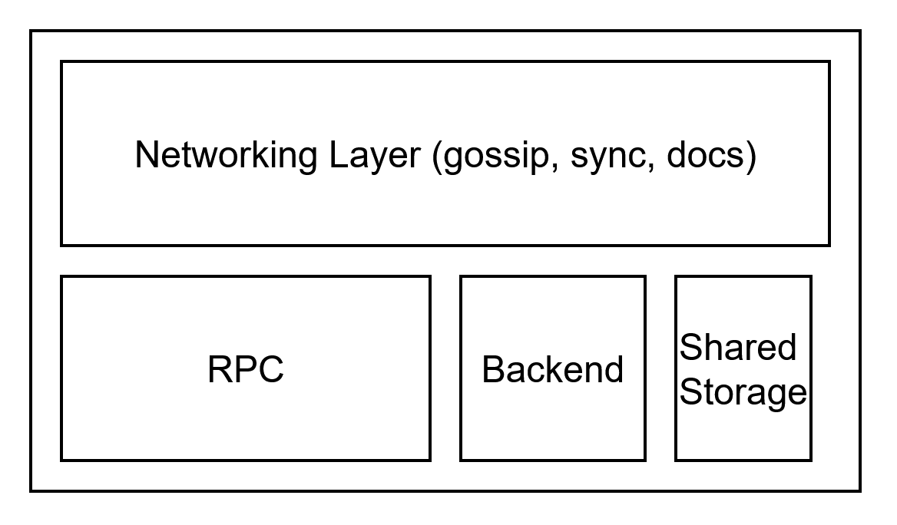

# Fangorn

Fangorn is the core protocol that enables practical witness encryption.

## Node Architecture

Each Fangorn node consists of:
- a networking layer for gossip and sync between nodes, built with Iroh
- a modular 'backend' that can be implemented on top of various chains, with substrate being a first implementation
- a dynamic and configurable shared storage:
  - docstore for reading ciphertexts
  - intent store for reading intents
- an RPC to enable decryption
- a configurable `GadgetRegistry` that allows the node to understand specific intent types



## Node Setup and Sync Protocol

The core protocol for setting up a node service lives in [service.rs](./src/service.rs) using a pattern heavily inspired by substrate.

The network requires a bootstrap node to be online in order to sync with new nodes. Currently, the bootstrap node is responsible for generating the public parameters (KZG commitment) required to power the network. It also outputs a `ticket` that other nodes need to know in order to sync their state with the bootstrap node. Once the network is live, the bootstrap node can safely go offline. 

## Setup

### Build

``` sh
cargo build
```

### Run

Interaction with Fangorn is done via a CLI.

```
> fangorn run --help
Usage: fangorn run [OPTIONS] --bind-port <BIND_PORT> --rpc-port <RPC_PORT> --index <INDEX>

Options:
      --bind-port <BIND_PORT>                Port to bind for incoming connections
      --rpc-port <RPC_PORT>                  Port for the RPC interface
      --index <INDEX>                        The index of a node
      --is-bootstrap                         Determine it the node should act as a bootstrap node
      --ticket <TICKET>                      The ticket to connect to a swarm [default: ]
      --contract-addr <CONTRACT_ADDR>        The contract address
      --bootstrap-pubkey <BOOTSTRAP_PUBKEY>  The bootsrap node public key
      --bootstrap-ip <BOOTSTRAP_IP>          The bootstrap node ip
  -h, --help                                 Print help
```

For example, to start a bootnode that runs the iroh networking layer on 9933 and rpc on 30332 (dummy contract address):

``` sh
./target/debug/fangorn run \
--bind-port 9933 \
--rpc-port 30332 \
--is-bootstrap \
--index 0  \
--contract-addr "5EhyMXxc9TqnYxmKuFkk6sLzCm3CFWN8qfk7TA7T2va1vsGR"
```

and to sync with it, we must copy the public key and ticket output in the node logs on startup. The necessary config (KZG params) are gossiped to the incoming node from the bootstrap.

``` sh
./target/debug/fangorn run \
--bind-port 9945 \
--rpc-port 30334 \
--bootstrap-pubkey 86e22d820023ffe45b78f9d6b8b355bccd69b14b0a6882d5ae7ff56358e34a3d \
--bootstrap-ip 172.255.255.255:9932 \
--ticket docaaacaxzwhvoasmzkscqxaeciht74plakvljgysk4opsq7cmyfqzbmm5aafq5yjk3ci3y2ra4kt5lhpu7hafvrzhlcu5ss2yw6ahcaf43wc47aajdnb2hi4dthixs65ltmuys2mjoojswyylzfzuxe33ifzxgk5dxn5zgwlrpaiagd55ruhz54ayavqolfponju \
--index 1 \
--contract-addr "5EhyMXxc9TqnYxmKuFkk6sLzCm3CFWN8qfk7TA7T2va1vsGR"
```

## RPC

### **RPC Methods**

| Method               | Request Type              | Response Type              | Description                                                                                               |
| -------------------- | ------------------------- | -------------------------- | --------------------------------------------------------------------------------------------------------- |
| **Preprocess**       | `PreprocessRequest`       | `PreprocessResponse`       | Requests encryption and aggregation keys (system key) from a node for setup.                              |
| **Partdec**          | `PartDecRequest`          | `PartDecResponse`          | Requests a partial decryption from a node for a given ciphertext/witness.                                 |

---

## **Message Types**

### **PreprocessRequest**

| Field    | Type | Description                                             |
| -------- | ---- | ------------------------------------------------------- |
| *(none)* | —    | Empty request used to request preprocessing parameters. |

### **PreprocessResponse**

| Field                    | Type     | Description                                                             |
| ------------------------ | -------- | ----------------------------------------------------------------------- |
| `hex_serialized_sys_key` | `string` | The hex-encoded serialized system key (aggregation/encryption context). |

---

### **PartDecRequest**

| Field         | Type     | Description                                                          |
| ------------- | -------- | -------------------------------------------------------------------- |
| `filename`    | `string` | Identifier for the ciphertext stored remotely (e.g., IPFS filename). |
| `witness_hex` | `string` | Hex-encoded witness used for partial decryption.                     |

### **PartDecResponse**

| Field                       | Type     | Description                                           |
| --------------------------- | -------- | ----------------------------------------------------- |
| `hex_serialized_decryption` | `string` | The node's partial decryption in hex-serialized form. |

---
